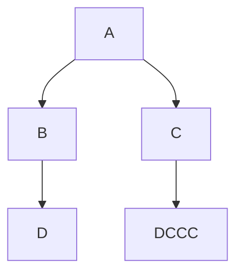
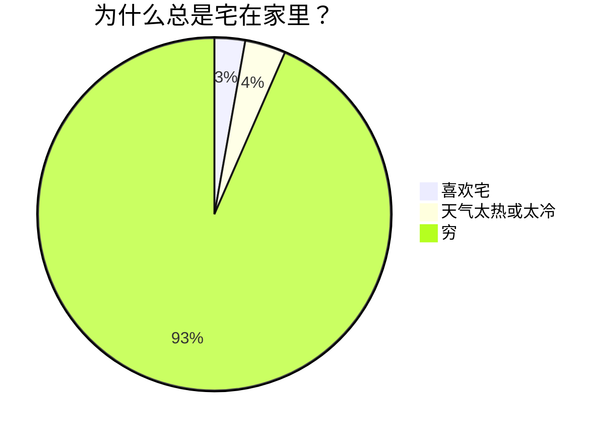

# 参与编辑

## 开始
按照 [docsify官方文档](https://docsify.js.org/#/zh-cn/) 和 [markdown官方文档](https://markdown.com.cn/basic-syntax/) 操作即可

[<< 返回首页](/README.md)
## 注意事项
1. 路径书写规范：`/README.md`前面要加个`/`，表示从根目录IdeaSharing开始。
   - 举个例子：假如我们正在编辑`IdeaSharing\\doc\\数学工具\\高等数学\\test.md`，若想跳转到`test.md`，应写下`[test](/doc/数学工具/高等数学/test.md)`。若写相对于高等数学的路径`test.md`，在vscode中是可以正确跳转的，但在页面上不行，所以要基于根目录来写相对路径。如果开头不加上`/`，虽然页面可以正确跳转，但vscode中不行，因为他会去当前目录（即高等数学）下找doc。用`/`而不是`\`分隔，这可能是因为url用`/`分隔。
   - 图片的路径不是这样，得按相对于所在目录的路径写，如``，不能用这种方法访问文件夹外的图片，但是还可以用html，但html又必须用相对于根目录的绝对路径，若你在编写matlab文件夹下的.md文件，以下三种方式是等效的：
 ```html

```

```markdown

```

```markdown

```
2. 由于我水平有限，不许使用`==高亮==`语法，请使用`<mark>高亮</mark>`语法。
   - 我没有找到相应的扩展包，只看见CSDN上有人发了个[帖子](https://blog.csdn.net/Hubz131/article/details/113062430)，分享他自己造的轮子，但是效果不佳，bug很多。(1)没有排除代码块中的`==`。(2)无法正确处理`这==种==情==况==`。(3)`==高亮==`等号必须紧贴需要高亮的文字，文字两边不能有空格。第(3)点是好解决的，但是(1)(2)还没搞定，主要原因是不会JavaScript，特别是正则表达式，分享一个研究过程中发现的网站 [MDN Web Docs](https://developer.mozilla.org/zh-CN/docs/Web/JavaScript/Guide/Regular_Expressions)。
3. 文档存储规则和侧边栏目录文件`_sidebar.md`：
   - 除了首页，其余文档文件都放在doc文件夹中。
   - 每个文件夹中除了`READEME.md`、`_navbar.md`和`_sidebar.md`和文件夹`figure`，要么只有文件夹，要么只有文件。暂时是这样，有需要可以升级。
   - 侧边栏的内容加载当前目录下的`_sidebar.md`。
   - 点击侧边栏中的文件夹字段，效果类似电脑上点开文件夹，不会展开，而是进入文件夹，侧边栏内容随之改变；点击md文件会按照标题展开。
4. `gcontent.py`的功能:
   - 如果它的各个子dir中没有`READEME.md`和`_navbar.md`，会自动生成。
   - 更新doc各个子dir中的以及首页的`_sidebar.md`，排序规则由os.walk()决定，按照字母数字顺序，但汉字不会按照拼音顺序，可能是按照对应编码的首字母或数字，所以应在文件名开头用数字编号。
   - 返回一些文件夹的路径(好像没用了)
5. 搜索栏的搜索范围，是_sidebar.md中包括的md文件，而且会过期。
   - 具体原理参考[优化 docsify 的 search 搜索功能](https://kebingzao.com/2020/09/30/docsify-search/)
## 功能展示

$a_1+b_2=c^2$

$$
\varGamma(x)=\frac{\int_{\alpha}^{\beta}g(t)(x-t)^2\text{d}t}{\phi(x)\sum_{i=0}^{N-1}\omega_i}\tag{1}
$$

```python
print('hello')
for i in range(5):
    if i%2==0 or i==1:
        print(i)
```

```html
<p>This is a paragraph</p>
<a href="//docsify.js.org/">Docsify</a>
```





