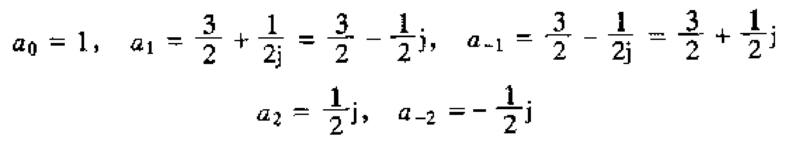

# 3.6.2展成复指数求x[n]频谱系数_需对周期分类讨论
## 书上例题引发的思考
题目如下：
|  | 
|:--:| 
| *Fig.1* |
- 用欧拉公式 $\cos\theta=\frac{e^{j\theta}+e^{-j\theta}}{2}$ 和 $\sin\theta=\frac{e^{j\theta}-e^{-j\theta}}{2j}$ 把三角形式转化为复指数形式
- 然后与综合公式 $$x[n]=\sum_{k=\langle N\rangle}a_ke^{jk\frac{2\pi}{N}n}$$ 比较得 $a_k$：

|  | 
|:--:| 
| *Fig.2* |
- 问题就出在这，我们知道离散傅里叶级数的 $a_k$ 具有周期性，而这里每个 $a_k$ 都不一样，那如果周期N=3，岂不是有 $a_{-2}=a_1$？按上面这个结果，N至少得是5？
- 事实上，与综合公式比较时，要对周期N的大小分类讨论。
## 以N=3为例说明问题
- 若N=3，展成的复指数形式为：
$$x[n]=(-\frac{1}{2}j)e^{-2j\frac{2\pi}{3}n}+(\frac{3}{2}+\frac{1}{2}j)e^{-j\frac{2\pi}{3}n}+1+(\frac{3}{2}-\frac{1}{2}j)e^{j\frac{2\pi}{3}n}+(\frac{1}{2}j)e^{2j\frac{2\pi}{3}n}$$
- 而对应的综合公式长这样：
$$x[n]=a_{-1}e^{-j\frac{2\pi}{3}n}+a_{0}+a_{1}e^{j\frac{2\pi}{3}n}$$
- 并不可以直接对比系数。
- 若是熟悉离散时间复指数信号在频率上的周期性：频率上相差 $2\pi$ 的整数倍的离散时间复指数信号都是一样的。即
$$e^{jk\frac{2\pi}{N}n}=e^{jk\frac{2\pi}{N}n}e^{j(r2\pi)n}=e^{j(k+rN)\frac{2\pi}{N}n}, r\in Z$$
- 马上会发现
$$e^{2j\frac{2\pi}{3}n}=e^{-j\frac{2\pi}{3}n},e^{-2j\frac{2\pi}{3}n}=e^{j\frac{2\pi}{3}n}$$
- 故
$$a_{-1}=\frac{3}{2}+j,a_0=1,a_1=\frac{3}{2}-j$$
## 正确的答案
由于这些系数是周期的，只用列出一个求和间隔(N个连续整数)内的 $a_k$ 。
- 对于求和间隔内其余未列出的k值有 $a_k=0$ ，N=3见上一目。
- 若N=1
$$a_0=4$$
- 若N=2
$$a_0=1,a_1=3$$
- 若N=4
$$a_{-1}=\frac{3}{2}+\frac{1}{2}j,a_0=1,a_1=\frac{3}{2}-\frac{1}{2}j,a_2=0$$
- 若N>=5
$$a_{-2}=-\frac{1}{2}j,a_{-1}=\frac{3}{2}+\frac{1}{2}j,a_0=1,a_1=\frac{3}{2}-\frac{1}{2}j,a_2=\frac{1}{2}j$$