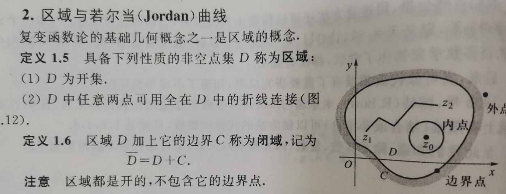
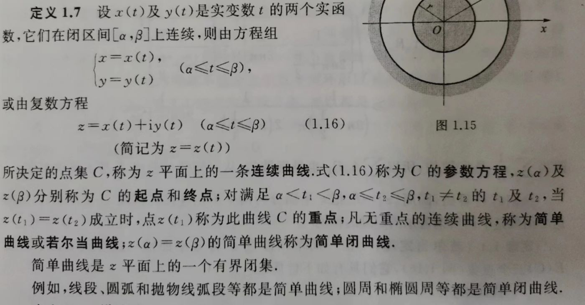
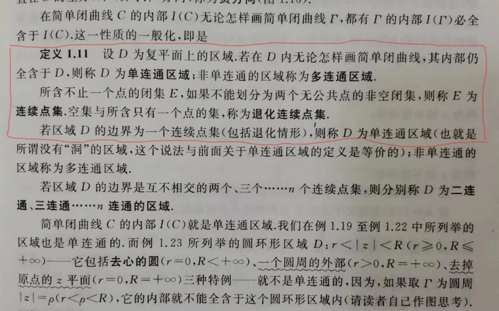
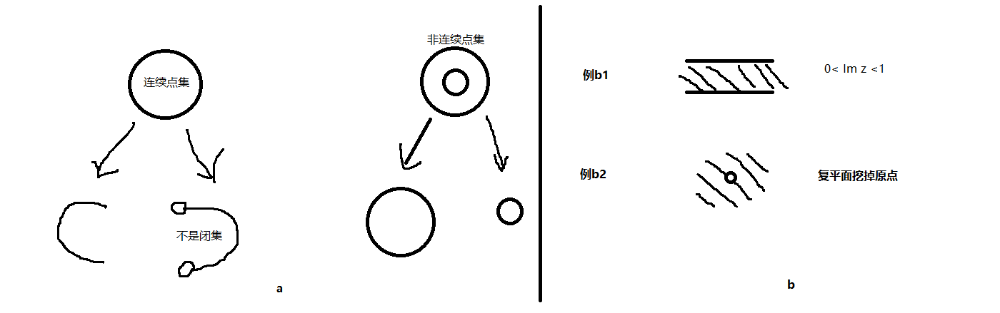

# 1.2.1用连续点集判断单连通的反例

## 1.平面点集基本概念
考虑点集 $E$：
- 若 $z_0$（不必属于 $E$ ）的任意邻域含有 $E$ 的无穷多个点，则称 $z_0$ 为 $E$ 的**聚点**，用 $E'$ 表示。
- 若 $z_0\in E$ 但 $z_0\notin E'$，则称 $z_0$ 为 $E$ 的**孤立点**。既不属于 $E$ ，又不是 $E$ 的聚点，则称**外点**。
- 若 $z_0$ 的某一邻域全包含于 $E$，则称 $z_0$ 为 $E$ 的**内点**。
- 若 $E'\subseteq E$，则称 $E$ 为**闭集**；若点集 $E$ 中的点皆为内点，则 $E$ 为**开集**。
- 若在点 $z_0$ 的任意邻域内，同时有属于 $E$ 和不属于 $E$ 的点，则 $z_0$ 为 $E$ 的**边界点**，这样的点组成的点集为 $E$ 的**边界**，用 $\partial E$ 表示。

一些结论：
- 孤立点必是边界点，但一定不是聚点。
- $聚点=
\begin{cases}
\text{内点}\\
\text{边界点去掉孤立点}
\end{cases}$ $点集E=
\begin{cases}
\text{内点}\\
\text{孤立点}
\end{cases}$
- 内点肯定不是孤立点，所以开集无孤立点，但可能非连通（有好几块）。

例$1.18$ 证点集 $E$ 的边界是闭集，即证 $(\partial E)'\subseteq \partial E.$  
- 任取 $z\in (\partial E)'$，由聚点定义知，$z$ 的任意邻域 $N$ 中必存在一点 $z_0\in \partial E$，且可作一充分小 $z_0$ 的邻域 $N_0$（全包含于 $N$）；因为 $z_0$ 是 $E$ 的边界点，所以 $N_0$ 中同时有属于 $E$ 和不属于 $E$ 的点，因此 $N$ 中也同时有属于 $E$ 和不属于 $E$ 的点，由边界点定义得 $z\in \partial E.$
## 2.区域与若尔当曲线
### 区域与闭域
|  | 
|:--:| 
| *Fig.1 课本定义* |
- 这里的区域是连通开集。
- 注意区分闭域与闭集。
### 若尔当曲线（简单曲线）
|  | 
|:--:| 
| *Fig.2 课本定义* |
- 闭区间连续必有界。
- t1取开区间，t2取闭区间，若z(t1)=z(t2)，则z(t1)为重点。
- 可求长
- 光滑曲线，首先是简单曲线，然后要求实部虚部的导数在定义域上连续且不全为0。
- 光滑闭曲线，除了简单闭曲线和光滑曲线的要求，还要求$t=\alpha$时的切线与$t=\beta$时的重合。
- 逐段光滑曲线必可求长，简单曲线不一定可求长。
  - 例如$$
\begin{cases}
x(t)=t\\
y(t)=\begin{cases}
t \sin\frac{1}{t},& t \ne 0 & \\
0,& t = 0 &
\end{cases}
\end{cases}, (0\le t\le 1)$$

- **定理1.1 (若尔当定理)** 任一简单闭曲线 $C$ 将平面唯一地分成 $C,I(C),E(C)$ 三个点集，它们具有如下性质：
  - （1）彼此不相交
  - （2）$I(C)$ 是一个有界区域（称为 $C$ 的**内部**）
  - （3）$E(C)$ 是一个无界区域（称为 $C$ 的**外部**）
  - （4）若简单折线 $P$ 的一个端点属于 $I(C)$，另一端点属于 $E(C)$，则 $P$ 必与 $C$ 有交点。
## 3.判断单连通还是多连通
|  | 
|:--:| 
| *Fig.3 课本定义* |
- 理解连续点集：
  - 若一点集E的图示中有虚线(与实线相对，表示某线不在E中)或圈(与实心点相对，表示某点不在E中)，则E不是闭集。因为虚线中的点或是“圈”点的任意邻域内有无数包含于E的点，所以是聚点，但这些聚点不在E中，所以E不是闭集。
  - 因此一条简单闭曲线不能划分为两个无公共点的非空闭集，见 $Fig.4a$：

|  | 
|:--:| 
| *Fig.4 连续点集与反例* |

- $Fig.3$ 红框部分给出了两种判断方法：（1）区域中有没有洞.（2）区域的边界是不是一个连续点集.
- 对于 $Fig.4b例b1$，按方法1，显然是单连通区域；按方法2，这个区域的边界不是一个连续点集，可以分为 $Im(z)=1$ 和 $Im(z)=0$ 这两个非空闭集，故这个区域是多连通的。很奇怪。
- 对于 $Fig.4b例b2$，按方法1，显然是多连通区域；按方法2，这个区域的边界（原点）是一个退化连续点集，故这个区域是单连通的。
- 方法1其实是定义，所以方法1的判断是对的，所以我感觉方法2有一些问题。

知乎大佬 芷雨Chira 说:
> 方法二要考虑∞（见书上第一章第四节），复平面挖去原点的边界含有两个点：原点和∞，边界是两个退化连续点集的并，因而它是二连通区域；带状区域的边界是Im z=0、Im z=1、{∞}的并，因为直线经过∞，所以是一个连续点集，因而是单连通区域。