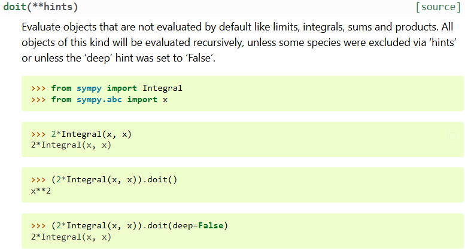

# 1. 积分技术

## 小工具
> VSCode 下载插件  Latex Sympy Calculator by OrangeX4

1. `Shift + Ctrl + Alt + N` 数值结果，直接替换原式
2. `Shift + Ctrl + Alt + E` 求导、积分、行列式、复制(算完了，与1搭配，复制然后替换为数值解)
3. `Shift + Ctrl + Alt + F` 因式分解，直接替换原式
4. `Shift + Ctrl + Alt + X` 展开(3的逆)，直接替换原式
5. `Shift + Ctrl + Alt + T` 矩阵初等行变换为简化行阶梯矩阵
6. `Shift + Ctrl + Alt + D` Define，可以用来设定一些符号
7. `Shift + Ctrl + P` 输入 `latex-sympy-calculator: Reset Current variances` 来重置6的定义
8. `Shift + Ctrl + Alt + P` calculate a python expression (具体看下面综合题)

感觉1-5可能就是8封装了一下，然后8是去调用sympy
关于sympy与numpy结合的拓展阅读 [How to integrate Sympy and Numpy in python? Numpy array of sympy symbols - Stack Overflow](https://stackoverflow.com/questions/58784150/how-to-integrate-sympy-and-numpy-in-python-numpy-array-of-sympy-symbols)
### 练习区

区间再现技术，使用1-2
$$
I = \int^\pi_0 x \sin^3xdx  = \frac{2 \pi}{3} = 2.0943951023932
$$

使用3-4
$$
x^{2} + 2 x y + y^{2}
$$

Reduced Row Echelon Form(RREF) 简化行阶梯矩阵, 使用5
$$
\begin{bmatrix}
    1 & 2 & 3\\
    4 & 5 & 6\\
    7 & 8 & 9
\end{bmatrix} \to \begin{bmatrix}1 & 0 & -1\\0 & 1 & 2\\0 & 0 & 0\end{bmatrix}
$$

使用8
$$
solve([2 * x - y - 3, 3 * x + y - 7],[x, y]) = {x: 2, y: 1} \\
latex(ones(3)) = \begin{bmatrix}1 & 1 & 1\\1 & 1 & 1\\1 & 1 & 1\end{bmatrix}
$$

使用6和8
$$
y = x+1 \\ 
var['y'] = x + 1
$$

$$
latex(fft([1,2,3],[4,5,6]))
$$

**综合题--求特征值、特征向量**
注意 6 的使用
For matrix: $A=\begin{bmatrix}	5 &6 &-3 \\	-1 &0 &1 \\	1 &2 &-1 \\\end{bmatrix}$

Let $B=\lambda\begin{bmatrix}1 &0 &0 \\0 &1 &0 \\0 &0 &1 \\\end{bmatrix}-\begin{bmatrix}	5 &6 &-3 \\	-1 &0 &1 \\	1 &2 &-1 \\\end{bmatrix}=\left[\begin{matrix}\lambda - 5 & -6 & 3\\1 & \lambda & -1\\-1 & -2 & \lambda + 1\end{matrix}\right]$

先使用6定义B

Its determinant is 
$$latex(var["B"].doit().det()) = \lambda^{3} - 4 \lambda^{2} + 2 \lambda + 4 = (\lambda - 2) (\lambda^{2} - 2 \lambda - 2)$$

Solve for eigenvalues
$$latex(solve(var["B"].doit().det())) = \left[ 2, \  1 - \sqrt{3}, \  1 + \sqrt{3}\right]$$

Or via:
$$latex(var["A"].eigenvals()) = \left\{ 2 : 1, \  1 - \sqrt{3} : 1, \  1 + \sqrt{3} : 1\right\}$$

Let $\lambda_1=2, \lambda_2=1-\sqrt{3}, \lambda_3=1+\sqrt{3}$

So $B_1=\lambda_1\begin{bmatrix}1 &0 &0 \\0 &1 &0 \\0 &0 &1 \\\end{bmatrix}-\begin{bmatrix}	5 &6 &-3 \\	-1 &0 &1 \\	1 &2 &-1 \\\end{bmatrix}=\left[\begin{matrix}-3 & -6 & 3\\1 & 2 & -1\\-1 & -2 & 3\end{matrix}\right]$

Assign it: $B_1=\left[\begin{matrix}-3 & -6 & 3\\1 & 2 & -1\\-1 & -2 & 3\end{matrix}\right]$

Simplify it by elementary row transformations:

$latex(var["B_1"].doit().rref()) = \left( \left[\begin{matrix}1 & 2 & 0\\0 & 0 & 1\\0 & 0 & 0\end{matrix}\right], \  \left( 0, \  2\right)\right)$
output: RREF, indices of the pivot columns

For the eigenvalue $\lambda_1=2$, its one eigenvector is $\xi_1=\begin{pmatrix}-2\\1\\0\end{pmatrix}$

So for the eigenvalue $\lambda_1=2$ its all eigenvectors are $k_1\xi_1 \ (k_1\neq 0, k_1\in P)$

In a same way, all eigenvalues and eigenvector are

$latex(var["A"].eigenvects()) = \left[ \left( 2, \  1, \  \left[ \left[\begin{matrix}-2\\1\\0\end{matrix}\right]\right]\right), \  \left( 1 - \sqrt{3}, \  1, \  \left[ \left[\begin{matrix}6 - 3 \sqrt{3}\\-2 + \sqrt{3}\\1\end{matrix}\right]\right]\right), \  \left( 1 + \sqrt{3}, \  1, \  \left[ \left[\begin{matrix}3 \sqrt{3} + 6\\-2 - \sqrt{3}\\1\end{matrix}\right]\right]\right)\right]$

## 区间再现

$$
\int_a^b f(x)dx = \int_a^b f(a+b-x)dx
$$

$$
I = \int^\pi_0 x \sin^3xdx = \frac{\pi}{2} \int^\pi_0 \sin^3xdx = \frac{2 \pi}{3}
$$

