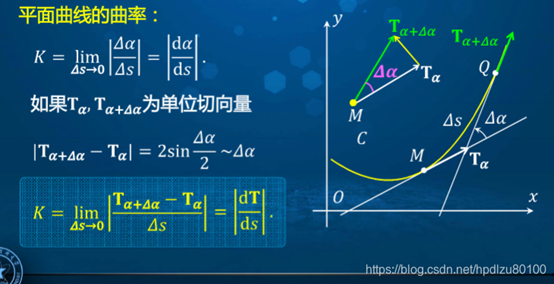
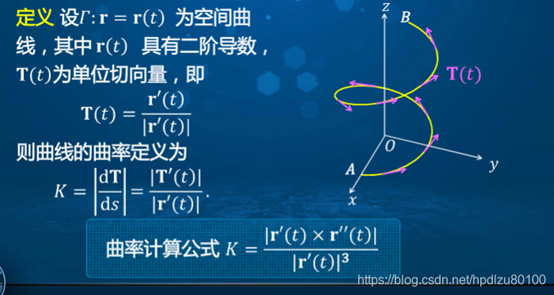

# 1.曲率_位矢对弧长二阶导_叉乘

## 参考资料
1. [高等数学学习笔记------第六十一讲------空间曲线的弧长与曲率\_空间曲线弧长-CSDN博客](https://blog.csdn.net/hpdlzu80100/article/details/105186250)
2. [转动参考系与极坐标系的联系 / 科里奥利力是啥? 附赠一个极其常用的力学运算技巧 - 知乎](https://zhuanlan.zhihu.com/p/52892796)
3. [三维空间中的曲线 - 小时百科](https://wuli.wiki/online/Curv3D.html)

## 解释

贴两张 参考资料1 的图：

图一：取一个小微元，曲率 = 切向量角度变化量 $\text{d}\alpha$ / 小段弧长(弧微分) $\text{d}s$
切向量角度变化量 $\text{d}\alpha$ 的模 = 单位切向量（$T_\alpha \equiv \vec{e}_v$）的增量 $\text{d}\alpha ~ \vec{e}_\alpha$ 的模

图二：看到叉乘卡住了。

阅读 参考资料2 了解了一个有意思的公式（我们会在求单位方向矢量的导数时用到它）
$$
\frac{\text{d}}{\text{d}t}\vec{A }=\vec{\omega_A }\times \vec{A },\ \left| A  \right|=\text{const}
$$
> 就是说 "长度不变的矢量关于时间求导等于它的角速度与它自己的矢量积"

以及 $\vec{r}$ 的运动在柱坐标系下可拆解为 拉伸 + 旋转，体现在下文速度 $\vec{v}$ 的表达式中。

然后跟着推了一下科里奥利力后，就有想法了。

简单符号说明：

$$
 r \equiv \left\vert \vec{r} \right\vert , \omega \equiv \left\vert \vec{\omega} \right\vert , v \equiv \left\vert \vec{v} \right\vert
$$

$$
\omega \equiv \dot{\varphi }
$$

Begin：

$$
\vec{v} = \frac{\text{d}}{\text{d}t}\vec{r}=\dot{r}{{\vec{e}}_{r}}+r\omega{{\vec{e}}_{\varphi }} = \dot{r}{{\vec{e}}_{r}}+\vec{\omega }\times {{\vec{r}}}
$$

$$
\begin{aligned}
\vec{r} \times \vec{v} &= \vec{r} \times (\dot{r}{{\vec{e}}_{r}}+\vec{\omega }\times {{\vec{r}}}) \\
&= \vec{r} \times (\vec{\omega}\times {{\vec{r}}}) \\
&= r^2 \vec{\omega } - (\vec{r} \cdot \vec{\omega}) \vec{r} \\
&= r^2 \vec{\omega } \\
\end{aligned}
$$

$$
\vec{\omega } = \frac{\vec{r} \times \vec{v}}{r^2}
$$

把 $\vec{r}$ 换成 $\vec{v}$，$\vec{v}$ 换成 $\vec{a}$，易得 $\vec{v}$ 的角速度 $\vec{\omega_v }$ ：

$$
\vec{\omega_v } = \frac{\vec{v} \times \vec{a}}{v^2}
$$

注意

$$
\frac{\text{d}\vec{e}_v}{\text{d}t} = \vec{\omega_v } \times \vec{e}_v \equiv \frac{\text{d}\alpha}{\text{d}t} \vec{e}_\alpha
$$

又因为 $\vec{\omega_v }$ 和 单位向量 $\vec{e}_v$ 垂直，所以

$$
\frac{\text{d}\alpha}{\text{d}t} = \left\vert \vec{\omega_v } \right\vert = \left\vert \frac{\vec{v} \times \vec{a}}{v^2} \right\vert 
$$

由于弧长的导数等于位矢的速率，即:

$$
\frac{\text{d}s}{\text{d}t} = \left\vert \frac{\text{d}\vec{r}  }{\text{d}t}\right\vert  = \left\vert \vec{v} \right\vert = v
$$

所以

$$
\kappa = \left\vert \frac{\text{d}\alpha}{\text{d}s} \right\vert = \left\vert \frac{\frac{\text{d}\alpha}{\text{d}t}}{\frac{\text{d}s}{\text{d}t}} \right\vert = \left\vert \frac{\vec{v} \times \vec{a}}{v^3} \right\vert 
$$